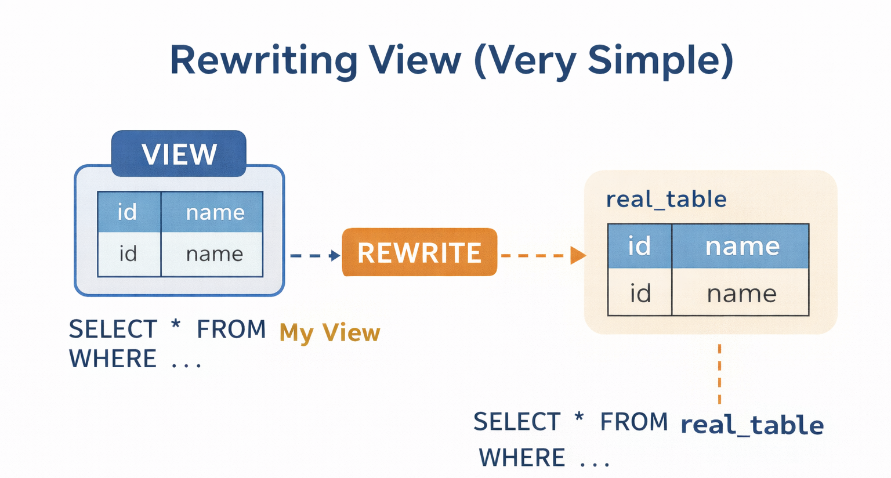

# PostgreSQL Internal Architecture – Inside the Backend Process (Deep, Slow, Complete Flow)

## Pause and Reset the Mental State

In the previous file, a client connected, authentication succeeded, and a backend process was born. From this point onward, the postmaster is no longer involved. The client is now talking directly to its own backend process.

This file explains what happens **inside that backend** when a single SQL query is sent. Not multiple queries. Not transactions yet. One query. From text to result.

If you understand this file properly, SQL will stop feeling like magic strings and start feeling like structured instructions.

 
 

## The Query Enters PostgreSQL as Plain Text

- When a client sends a query, PostgreSQL receives it as plain text bytes, not as executable logic. At this stage, PostgreSQL does not know which tables or indexes are involved or how data will be accessed. The backend process must first interpret the text to understand what the query actually means.

 
 

## Parsing: Turning Text into Structure

- Parsing is the first internal step where PostgreSQL <mark><b>turns raw SQL text into something it can understand</b></mark>. The parser checks whether the SQL follows PostgreSQL’s grammar, and if the syntax is wrong, the query fails immediately without touching any data or tables. 

- When the syntax is valid, PostgreSQL <mark><b>builds a parse tree</b></mark>, which is a structured form of the query that describes its clauses and expressions in a way the system can work with.

 
 

## Rewriting: Changing the Query Before Executing It

- After parsing, PostgreSQL may change the query internally so it knows what really needs to be executed. A view is basically a saved SQL query that looks like a table but does not store data. When a query uses a view, PostgreSQL replaces the view name with the actual SQL written inside the view. This rewriting step makes sure the system works with the real query, so planning and execution stay simple and efficient.

 

<b>VIEW</b>

 

A view is basically a saved SQL query that behaves like a table. It doesn’t store data on its own. When you query a view, PostgreSQL opens the view, takes the SQL written inside it, and replaces your query with that SQL and runs that query on the real tables.

 

 
 

## Why Rewriting Happens Before Planning

- Rewriting happens before planning <u><b>so PostgreSQL can see the actual query</b></u>. If views were not expanded first, the planner would not know which real tables are involved and could choose a bad execution plan. Rewriting makes sure the planner has the full picture before deci

 
 

## Planning: Deciding *How* to Execute the Query

- At this stage PostgreSQL already understands what the query means, and now it decides <mark><b>how to run it</b></mark>. The same data can be fetched in different ways, like scanning the whole table, using an index, or joining tables in different orders. Instead of guessing, PostgreSQL compares these options and estimates their cost, then chooses the plan that should be the most efficient.

 
 

## How the Planner Thinks

- The planner makes decisions using statistics stored inside PostgreSQL, such as how many rows a table has and how data is spread across columns. 

- Using this information, it estimates how much CPU, memory, and disk I/O each possible plan might need. The goal is not to find the perfect plan, but to choose one that is cheap enough and efficient in practice.

 
 

## Why Planning Is CPU-Intensive

- Planning uses a lot of CPU because PostgreSQL has to evaluate many possible ways to run a query, especially for complex queries. To avoid wasting CPU by doing this repeatedly, PostgreSQL <mark><b>supports prepared statements</b></mark> and plan caching so the same plan can be reused.

 

<b>Prepared Stataments</b>

 

- Prepared statements mean PostgreSQL prepares a query once by parsing and planning it, then reuses that plan every time the same query is executed again with different values. This saves CPU time because PostgreSQL does not have to plan the query again and again.

 

 
 

## Execution: Making the Plan Real

- Execution is the stage where PostgreSQL <mark><b>actually runs the chosen plan</b></mark>. The executor follows the plan step by step, performing operations like scanning tables, filtering rows, and joining results. This is the phase where <mark><b>data is really read from storage</b></mark> and, <mark><b>if required, written or modified</b></mark>.

 
 

## Memory Use During Execution

- While a query is running, PostgreSQL uses memory <mark><b>to temporarily hold data</b></mark> it is working on, such as sorted rows or join results. If this temporary data fits in memory, the query finishes quickly. If it becomes too large, PostgreSQL has to write it to disk and read it back later, which makes the query much slower. That’s why memory configuration plays a big role in performance.

 
 

## Returning Results to the Client

- As PostgreSQL produces rows, it sends them to the client over the network immediately. It does not wait for the entire result set to be ready, but <mark><b>streams results as they are generated</b></mark>. This makes responses faster and avoids using too much memory.

 
 

## What Happens After Execution Ends

- After a query finishes, the <mark><b>backend process frees the temporary memory</b></mark> it used and <mark><b>stays alive for the session</b></mark>, waiting for the next query. If the query was read-only, nothing new is written to disk; disk writes happen only when data is actually modified.

 
 

## Why This Separation Matters

- This separation matters because each stage handles a different responsibility. Parsing, rewriting, planning, and execution are kept separate so PostgreSQL stays stable and can optimize each step independently. Because of this design, some queries fail early during parsing, some take time in planning, and others are slow only during execution.

 
 

## Mental Model to Keep

Think of the backend process as a careful translator. It translates text into structure, structure into strategy, and strategy into actions.

Only after this translation is complete does PostgreSQL touch actual data.

In the next file, we will slow down further and enter PostgreSQL’s memory model. That is where performance characteristics truly begin to emerge.
